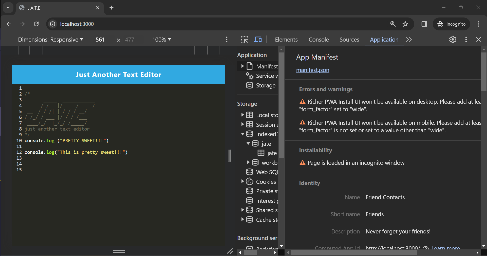
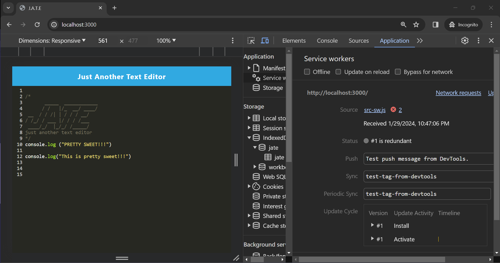
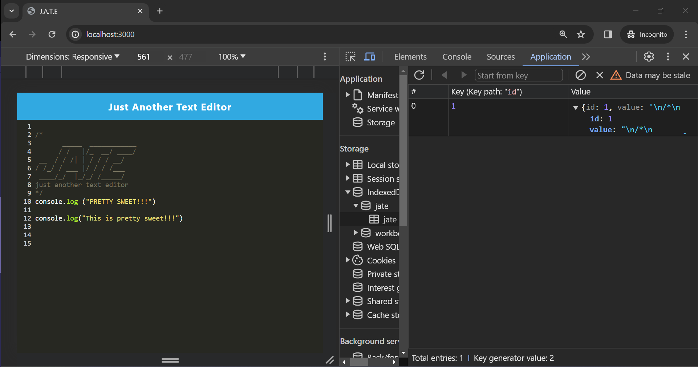

# Word-Craft (Challenge #19 - PWA)

## Table of Contents

- [Description](#description)
- [Installation](#installation)
- [Usage](#usage)
- [Test Sample](#test-sample)
- [Credits](#credits)
- [License](#license)

## Description

I want to create notes or code snippets with or without an internet connection so that I can reliably retrieve them for later use.

The task is to build a text editor that runs in the browser. The app will be a single-page application that meets the PWA criteria. Additionally, it will feature a number of data persistence techniques that serve as redundancy in case one of the options is not supported by the browser. The application will also function offline.

To build this text editor, you will start with an existing application and implement methods for getting and storing data to an IndexedDB database. You will use a package called `idb`, which is a lightweight wrapper around the IndexedDB API. It features a number of methods that are useful for storing and retrieving data, and is used by companies like Google and Mozilla.

You will deploy this full-stack application to Render using the [Render Deployment Guide on The Full-Stack Blog](https://coding-boot-camp.github.io/full-stack/render/render-deployment-guide)

## Installation

Use the following commands in the terminal in order to start your PWA:

``````
- npm i
- npm run build
- npm start
``````

## Usage

The application will meet the following criteria:

1. Uses IndexedDB to create an object store and includes both GET and PUT methods
2. The application works without an internet connection
3. Automatically saves content inside the text editor when the DOM window is unfocused
4. Bundled with webpack
5. Create a service worker with workbox that Caches static assets
6. The application should use babel in order to use async / await
7. Application must have a generated `manifest.json` using the `WebpackPwaManifest` plug-in
8. Can be installed as a Progressive Web Application

### Test Sample

This image shows the application's `manifest.json` file in an Incognito browswer window:




This image shows the application's `service worker` file in an Incognito browswer window:



This image shows the application's `IndexedDB storage` file in an Incognito browswer window:



### Credits

[Webpack](https://webpack.js.org/guides/getting-started/)

[IndexedDB](https://www.npmjs.com/package/idb)

[Service Workders](https://developer.mozilla.org/en-US/docs/Web/API/Service_Worker_API/Using_Service_Workers)

[Workbox](https://developer.chrome.com/docs/workbox)

[Render](https://dashboard.render.com/)

[SMU Bootcamp Activities Module 19](https://techbootcamps.smu.edu/coding/landing-ftpt-b5a/?s=Google-Brand_Tier-1_&dki=Learn%20Coding%20and%20More%20Online&pkw=smu%20coding%20bootcamp&pcrid=454243062435&pmt=e&utm_source=google&utm_medium=cpc&utm_campaign=GGL%7CSMU%7CSEM%7CCODING%7C-%7COFL%7CTIER-1%7CALL%7CBRD%7CEXACT%7CCore%7CBootcamp&utm_term=smu%20coding%20bootcamp&s=google&k=smu%20coding%20bootcamp&utm_adgroupid=104873073054&utm_locationphysicalms=9026987&utm_matchtype=e&utm_network=g&utm_device=c&utm_content=454243062435&utm_placement=&gad_source=1&gclid=CjwKCAiAmZGrBhAnEiwAo9qHiRoAl-bNZ7GAouKuJ0JlnPSvLdiSbMlkquyCHKF7YMPzkpyL2pH2wBoCyb0QAvD_BwE&gclsrc=aw.ds)

### License

[](https://opensource.org/licenses/MIT)